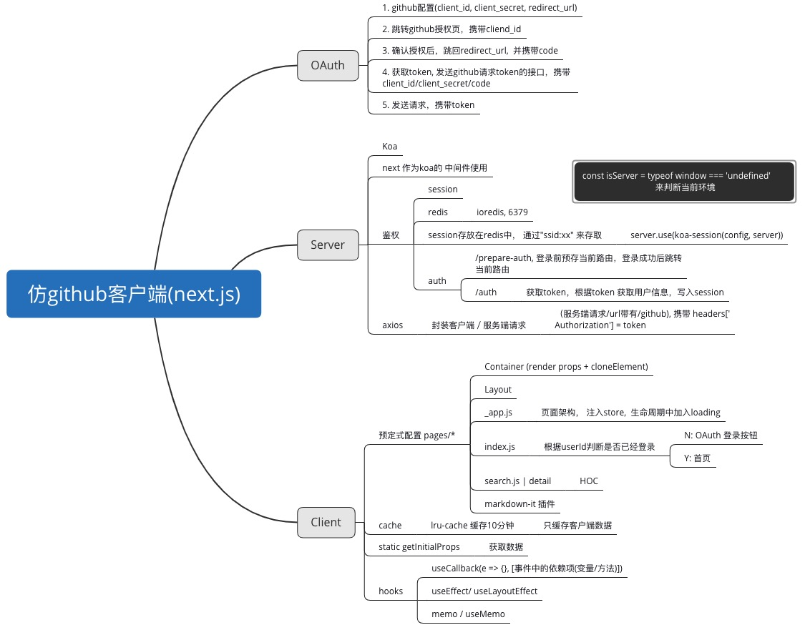

我是dev分支hellow
#### nextjs项目的创建
- 手动创建
    此项目使用的手动创建
- create-next-app
> npm i -g create-next-app
创建
> npx create-next-app projectname
> yarn create next-app projectname
> create-next-app projectname

#### next作为koa中间件
- nextjs自身带有服务器，只处理ssr
- 处理http请求，并根据请求数据返回相应的内容

无法处理
- 数据接口
- 数据库连接
- session状态

#### nextjs集成antd
nextjs不支持css文件引入
解决： 
> yarn add @zeit/next-css
或者
css in js

antd 按需加载
> yarn add antd babel-plugin-import
配置.babelrc文件

#### nextjs 
- 路由调转
1. import Link from 'next/link'
<Link href='/a' ></Link>
Link 会渲染成button，监听点击事件，路由跳转

2. Router模块
import Router from 'next/router'
Router.push('/a')

**动态路由**
只有query，没有params
<Link href='/a?id=1' ></Link>

**路由映射**
link上的as 属性
<Link href='/a?id=1' as='/a/1'></Link>
Router.push({
    pathname: '/a',
    query: {
        id: 1
    }
}, '/a/1')

bug: 刷新会报404
解决：在服务端解决

**Router 钩子**
// histroy
routerChangeStart
beforeHistroyChange
routerChangeComplete
// hash
hashChangeStart
hashChangeComplete

**nextjs 数据获取**
只有在pages 下的组件有效
Com.getInitalProps = (ctx)=>{
    return {}
}
返回的数据，会序列化为字符串，存在html中，客户端可以从html中获取数据

**自定义app / document**
pages/_app.js
pages/_document.js //服务端渲染时执行

**按需加载**
LazyLoading
1. 异步模块
一般在getInitialPorps中
const Mou = await import('xx')
Mou.default.xx

2. 异步组件
import dynamic from 'next/dynamic'
const Comp = dynamic(import('xx'))

**hooks**
- useState 与 useReducer
useReducer 是 useState的 底层
- useLayoutEffect 与 useEffect
useLayoutEffect在dom渲染前执行，useEffect在dom渲染后执行
- useContext
- useRef
**优化， 要配合 memo使用**
- useMemo
- useCallback
**闭包陷阱**
当遇到延时异步的操作，使用的是触发时的状态，不一定时当前最新的状态!

**规避**
 状态挂在ref上
 const ref = useRef() //ref会保持不变
ref.current = xx

**oAuth**
流程见 ./config.js

**静态页面导出**
next export

**项目部署**
1. 代码托管
2. 服务器上clone代码
3. pm2管理启动 
ecosystem.config.js pm2的配置文件

**总结**
- 同构的难点： 数据同步
getInitalProps,在服务端渲染时调用，数据存放在html中的<script id="__NEXT_DATA__">中，
客户端首次渲染，数据直接从中获取，避免重新请求数据
在客户端中使用数据缓存

- oAuth
第三方登录

- Cookie && Session
redis

- React Hooks

### 项目思维导图

  

